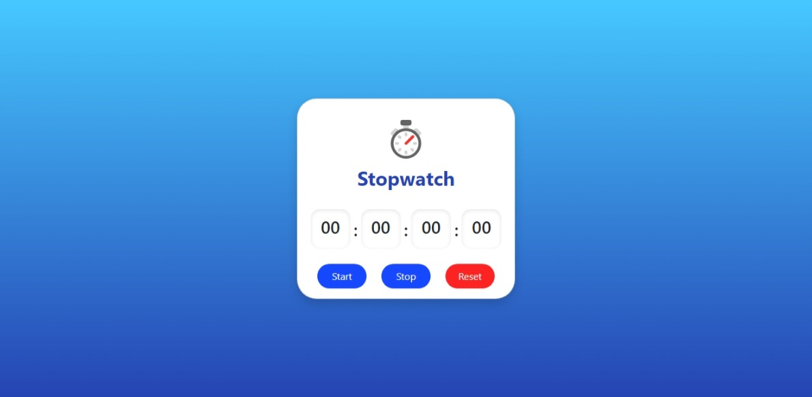
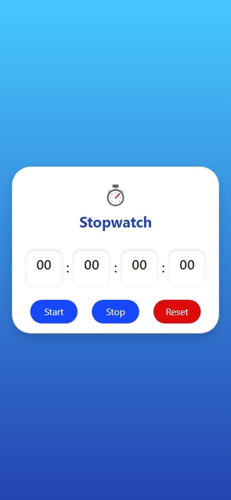

# Stopwatch App in React JS

## Overview

This project is part of the Codevixens Frontend Development Challenge (Day 8). A simple stopwatch application built using React. It demonstrates how to manage state, handle events, and use lifecycle methods to create a functional timer.

## Features

- **State Management**: Uses React's `useState` hook to manage the elapsed time and the running state of the stopwatch.
- **Event Handling**: Handles button click events for starting, stopping, and resetting the stopwatch.
- **Lifecycle Methods**: Uses `useEffect` to manage the timer interval, starting it when the component mounts and clearing it when the component unmounts or when the stopwatch is stopped.
- **Timer Logic**: Implements logic to increment the time every millisecond while the stopwatch is running.
- **User Interface**: Provides a display for the elapsed time and buttons for Start, Stop, and Reset.
- **Styling**: Uses CSS to style the application for a visually appealing look.

## Installation

1. Clone the repository:

```bash
git clone https://github.com/gideonagyage/Stopwatch-App.git
```

2. Navigate to the project directory:

```bash
cd Stopwatch-App
```

3. Install dependencies:

```bash
npm install
```

## Usage

1. Start the development server:

```bash
npm start
```

2. Open your browser and navigate to

```bash
http://localhost:3000.
```

## How it Works

The `Stopwatch` component is the main component that handles the following:

1. **State Management**: Manages the elapsed time and the running state of the stopwatch using `useState`.
2. **Event Handling**: Handles button clicks for Start, Stop, and Reset.
3. **Timer Logic**: Uses `useEffect` to create a timer interval that updates the elapsed time every millisecond.
4. **UI Rendering**: Renders the time display and the control buttons.

## Screenshots

- Desktop View



- Mobile View



<br>

## Live Demo

Check out the live demo [here](https://stopwatch-app-phi.vercel.app/).

## Key Concepts

1. **State Management**: Managing the data and UI state of the React application.
2. **Event Handling**: Responding to user interactions with the application.
3. **List Rendering**: Dynamically rendering lists of data in the React application.

## Contributing

Feel free to fork this repository and submit pull requests. Any contributions are welcome!

## License

This project is licensed under the MIT License.

## Acknowledgements

- [Codevixens](https://codevixens.org/) for organizing the challenge.
- Chinaza Igboanugo, Lois Bassey, and Oyinkansola Shoroye for their contributions and guidance.

Feel free to customize it further to fit your needs! If you have any specific details you'd like to add or change, let me know.
